<p align="center">
  
</p>

# taem

The **TAEM kernel** — a single Go binary that is the authoritative runtime for all preflight missions. When you run `taem`, you have the complete system. No servers, no agents, no orchestration platform required.

Named after NASA Mission Control's flight controller positions (Terminal Area Energy Management), TAEM runs a structured preflight protocol with 16 autonomous controllers across 7 phases before any code is written.

## Architecture

```
CLI (taem launch)
 └─→ Kernel
      ├─→ Gate State Machine (pure function, no network)
      ├─→ Controller Registry (from controllers.yaml)
      ├─→ Local Execution (12 deterministic controllers as goroutines)
      ├─→ Inference Router (Ollama → Anthropic fallback)
      ├─→ GitHub Dispatch (NAV, PAO)
      └─→ State Interface (mc-state via git)
```

## Mission Phases

| Phase | Controllers | Mode |
|---|---|---|
| 00 — Pad Check | GC, DPS, EECOM | Deterministic |
| 01 — Corpus Ingestion | NAV, FAO | Dispatch + Deterministic |
| 02 — Architectural Survey | ARCH, CDS, PCO | Deterministic |
| 03 — Plan Formulation | INCO | Deterministic |
| 04 — Pre-Code Inspection | SECINSP, TRC, PRB-SKP, PRB-COR, PRB-ADR | Inference + Deterministic |
| 05 — CAPCOM Output | CAPCOM | Deterministic |
| 06 — PAO Dispatch | PAO, DPS, SECINSP | Dispatch + Inference |

## Gate Protocol

The gate state machine is a **pure function** — no network, no side effects, testable in complete isolation:

```go
func Evaluate(phase int, required []string, signals []Signal, remediationCycles int) GateDecision
// Returns: ADVANCE | HOLD | ABORT
```

- All required controllers GO → **ADVANCE**
- Any NO-GO → **HOLD** (remediation check)
- Remediation cap (2 cycles) reached → **ABORT** (ESCALATED)
- PRB: 2/3 majority required, tie = NO-GO

## Controllers

16 controllers, each implementing the `Controller` interface:

```go
type Controller interface {
    Name() string
    Mode() ControllerMode  // deterministic | inference | github_dispatch
    Run(ctx context.Context, inputs Inputs) (Signal, error)
}
```

| Callsign | Role | Mode |
|---|---|---|
| GC | Infrastructure Health | Deterministic |
| DPS | Schema Integrity | Deterministic |
| EECOM | Resource Monitor | Deterministic |
| NAV | Integration Map Builder | GitHub Dispatch |
| FAO | Phase Timeline | Deterministic |
| ARCH | ADR Compliance | Deterministic |
| CDS | Conflict Detection | Deterministic |
| PCO | Pattern Compliance | Deterministic |
| INCO | Step Sequencer | Deterministic |
| SECINSP | Security Inspector | Inference |
| TRC | Test Readiness | Deterministic |
| PRB-SKP | Skeptic (adversarial) | Inference |
| PRB-COR | Correctness Auditor | Inference |
| PRB-ADR | ADR Compliance Auditor | Inference |
| CAPCOM | Developer Output | Deterministic |
| PAO | FABRIC/SOCIAL Trigger | GitHub Dispatch |

## Inference Model

Per [ADR-005](https://github.com/TAEM-DEV/adrs/blob/main/ADR-005.yaml) and [ADR-008](https://github.com/TAEM-DEV/adrs/blob/main/ADR-008.yaml) (Inference Model Strategy):

- **Primary model**: `qwen2.5-coder:7b` via Ollama (0.85 confidence threshold, 300s timeout)
- **Fallback**: `claude-sonnet-4-6` via Anthropic API
- **12 deterministic controllers**: zero LLM calls, zero cost, zero latency
- **4 inference controllers** (SECINSP, PRB-SKP, PRB-COR, PRB-ADR): Ollama first → Anthropic fallback
- **Phases 00–03 complete with zero LLM calls**
- If `OLLAMA_URL` not set → inference controllers emit HOLD, not direct Anthropic

## Quick Start

```bash
go install github.com/taem-dev/taem/cmd/taem@latest

# Required environment variables
export GH_TOKEN="ghp_..."                            # GitHub API token
export TAEM_MC_STATE_PATH="$HOME/mc-state"           # local clone of TAEM-DEV/mc-state
export TAEM_ADRS_PATH="$HOME/adrs"                   # local clone of TAEM-DEV/adrs
export TAEM_ECOSYSTEM_URL="http://localhost:30765"    # ecosystem Qdrant (k3s NodePort 30765)
export TAEM_APP_ID="123456"                           # GitHub App ID (taem-flight)
export TAEM_APP_PRIVATE_KEY_PATH="$HOME/.taem/taem-flight.pem"

# Optional — inference controllers
export OLLAMA_URL="http://localhost:30434"            # Ollama on k3s (NodePort 30434)
export ANTHROPIC_API_KEY="sk-ant-..."                 # Anthropic fallback

taem init          # Validate environment
taem launch \
  --type implement \
  --repos org/repo \
  --task "integrate service X" \
  --adrs ADR-001,ADR-002

taem status        # Mission status
taem watch         # Live mission stream
```

### Mission Types

- `--type implement` (default) — full preflight with step plan generation
- `--type review` — review missions produce empty step plans by design; the plan phase (INCO) emits GO with no steps

### Infrastructure Requirements

| Service | Location | Notes |
|---|---|---|
| Ecosystem (Qdrant) | k3s NodePort 30765 | Semantic layer for NAV cache, PRB memory |
| Ollama | k3s NodePort 30434 | Runs `qwen2.5-coder:7b` for inference controllers |
| GitHub App | `taem-flight` | App token access for NAV dispatch to target repos |
| mc-state | Local clone | `TAEM-DEV/mc-state` — mission signals, manifests, plans |
| adrs | Local clone | `TAEM-DEV/adrs` — ADR constraint corpus |

## Related Repos

| Repo | Relationship |
|---|---|
| [adrs](https://github.com/TAEM-DEV/adrs) | ADR constraint corpus — ARCH reads this |
| [ecosystem](https://github.com/TAEM-DEV/ecosystem) | Qdrant semantic layer — NAV cache, PRB memory |
| [mc-state](https://github.com/TAEM-DEV/mc-state) | Mission state store — signals, manifests, plans |
| [missions](https://github.com/TAEM-DEV/missions) | Mission definitions and dispatch templates |

## Active ADRs

All code in this repo is governed by [ADR-000](https://github.com/TAEM-DEV/adrs/blob/main/ADR-000.yaml) through [ADR-008](https://github.com/TAEM-DEV/adrs/blob/main/ADR-008.yaml). Key ADRs:

- **ADR-005** — Cost-conscious inference: deterministic-first, Ollama primary, Anthropic fallback
- **ADR-007** — Controller execution paths (local_deterministic, local_inference, github_dispatch)
- **ADR-008** — Inference Model Strategy: `qwen2.5-coder:7b` as primary model (replaces llama3.2)

See the [adrs repo](https://github.com/TAEM-DEV/adrs) for the complete constraint corpus.

<!-- org-footer -->
---

<p align="center"><sub>Part of <a href="https://github.com/TAEM-DEV">TAEM</a> · mission control preflight for software integration · built by <a href="https://github.com/ry-ops">ry-ops</a></sub></p>
